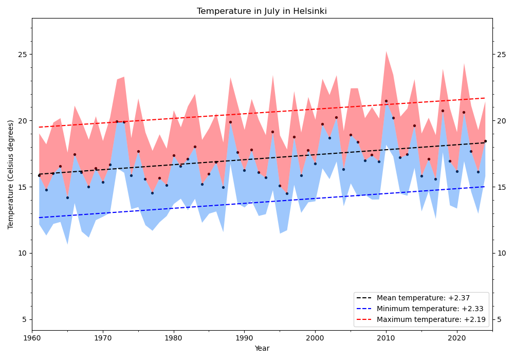

# Geospatial analysis of the temperature in Finland

This project enables to analyse geospatial data to study the evolution of the
temperature. While the project was originally based on data from the Finnish
Meteorological Institute (https://en.ilmatieteenlaitos.fi/), it should
be able to use it to analyse similar data from other countries.

## Install

The project is based on Python 3.10. I recommend to use conda and the provided
`environment.yml` file:

.. code:: shell

    $ conda env create -f environment.yml

## Simple example

To create a map of the mean temperature in June 2023:

.. code:: shell

    $ python mean_temp_per_month.py --year 2023 --month 6

To plot the evolution of the temperature in each given municipality
in July, between 1961 and 2024:

.. code:: shell

    $ python temp_evolution_per_municipality.py --month 7

To create an interactive map showing the mean temperature in Finland in
January and July for the year 1961, 1981, 2001 and 2021:

.. code:: shell

    $ python interactive_map.py

## Bugs and development

I welcome all changes/ideas/suggestion, big or small, that aim at improving
the projects. Feel free to fork the repository on GitHub and create pull
requests.
Please report any bugs that you find
[here](https://github.com/qsalome/temperature-evolution-Finland/issues).

